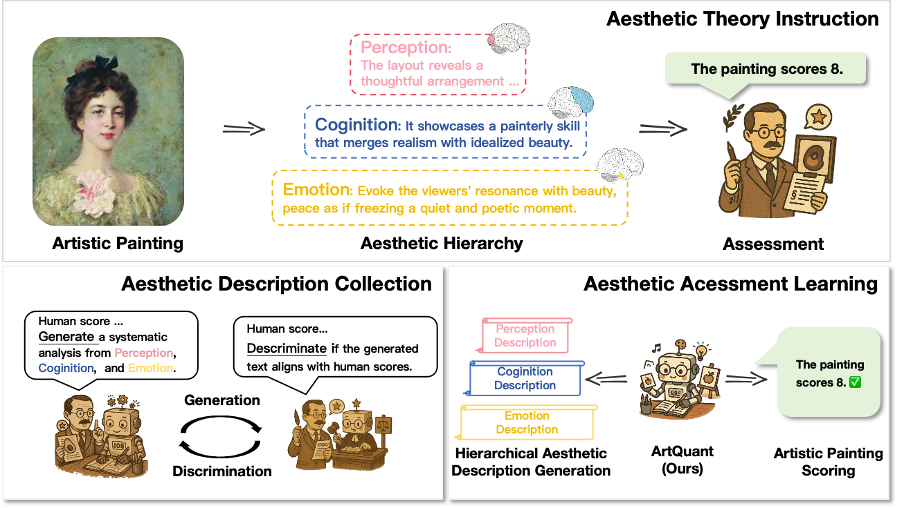
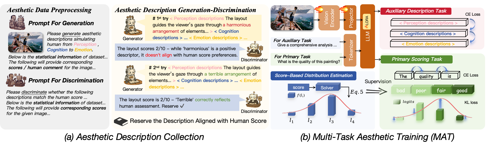

<div align="center">
  <h1>Bridging Cognitive Gap: Hierarchical Description Learning for Artistic Image Aesthetics Assessment</h1> 
[](https://huggingface.co/datasets/Liuuuu123/RAD)
[](https://huggingface.co/Liuuuu123/ArtQuant/edit/main/README.md)


<h2>Motivation</h2> 

<div style="width: 100%; text-align: center; margin:auto;">
      
</div>

<h2>Method</h2> 

<div style="width: 100%; text-align: center; margin:auto;">
      
</div>
</div>


## 🔧 Installation

If you only need to infer / evaluate:

```shell
pip install -e .
```

For training, you need to further install additional dependencies as follows:

```shell
pip install -e ".[train]"
pip install flash_attn --no-build-isolation
```


## Training, Inference & Evaluation


### 💪 Preprocess
The APDD dataset has been processed [APDD/apdd_score.json](https://huggingface.co/datasets/Liuuuu123/RAD). If you use the Score-Based Distribution Estimation algorithm (§3.2) for your dataset, you can use the [example script](preprocess/preprocess.ipynb).

### 🔥 Training

Fine-tuning needs to download the mPLUG-Owl2 weights as in [Pretrained Weights](#pretrained_weights). Put it under the [ModelZoo](./ModelZoo) folder.


- Only **2 RTX3090 GPUs** are required. 

```shell
sh train.sh
```

### 🚀 Inference

After training, you can infer with:

```shell
sh infer.sh $ONE_GPU_ID
```


### 🔍 Evaluation

After inference, you can evaluate SRCC / PLCC for quality score.

```shell
sh eval.sh
```